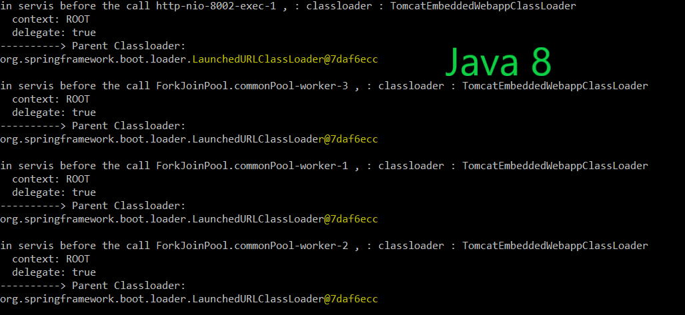

# This is just a test project for XML problems with Java 11

Just call GET :  http://localhost:8002/test
First endpoint (/test) is calling second endpoint (/xml) in parallel stream 4 times.

1. With Java 11 running outside of IDEA (java -jar xml-0.0.1-SNAPSHOT.jar) it crashed 1. time. Every next attempt works. 
2. When running inside IDEA XmlApplication with Java 11, parallelStream() works.
3. When running with Java 8 everything works.
4. When running with Java 11 and replace parallelStream with stream, it works
5. When assigning thead before the call, it works : Thread.currentThread().setContextClassLoader(this.getClass().getClassLoader());

6. In Java 8 no problems, in IDEA no problems 

## Classloaders

